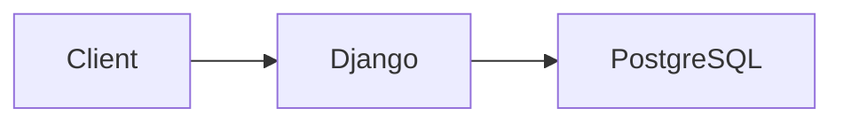

# OpenRed Documentation

This directory contains the OpenRed documentation built with **MkDocs** and **Material for MkDocs** theme.

## 📚 Documentation Structure

```
docs/
├── index.md                      # Home page
├── getting-started/              # Installation and setup guides
│   ├── installation.md
│   ├── quick-start.md
│   └── configuration.md
├── architecture/                 # System architecture docs
│   ├── overview.md
│   ├── data-hierarchy.md
│   ├── apps-structure.md
│   └── background-jobs.md
├── api-reference/                # API documentation (auto-generated)
│   ├── missions.md
│   └── measures.md
└── guides/                       # User guides
    ├── uploading-tracks.md
    └── datetime-fields.md
```

---

## 🔧 How It Works

### MkDocs + mkdocstrings

This documentation uses **mkdocstrings** to automatically generate API documentation from Python docstrings. This means:

✅ **Single Source of Truth**: Documentation lives in Python code  
✅ **No Duplication**: `.md` files only contain examples and structure  
✅ **Auto-Updated**: Changes to docstrings automatically update docs  

### Example

In `docs/api-reference/missions.md`:

```markdown
## ProjectViewSet

::: missions.views.ProjectViewSet
    options:
      show_root_heading: true
      show_source: false
```

This directive **automatically extracts** the docstring from `missions/views.py` and renders it as HTML.

---

## 🚀 Building the Documentation

### Local Development Server

Start the live-reloading development server:

```bash
mkdocs serve
```

Then open http://localhost:8000 in your browser. The documentation will automatically reload when you save changes.

**Custom port:**
```bash
mkdocs serve -a localhost:8765
```

### Build Static Site

Generate the static HTML site:

```bash
mkdocs build
```

Output will be in the `site/` directory.

---

## ✍️ Writing Documentation

### 1. Python Docstrings (Primary)

**For API documentation**, write docstrings in Python code using **Google style**:

```python
def my_function(arg1: str, arg2: int) -> bool:
    """
    Short description of the function.
    
    Longer description with more details about what this function
    does, how it works, and any important notes.
    
    Args:
        arg1: Description of first argument
        arg2: Description of second argument
    
    Returns:
        Description of return value
    
    Raises:
        ValueError: When arg2 is negative
    
    Example:
        >>> my_function("test", 5)
        True
    """
    pass
```

**Documented apps:**
- ✅ `missions/` - models, serializers, views, admin
- ✅ `measures/` - models, serializers, views, admin, tasks
- ✅ `devices/` - models, serializers, views, admin, forms
- ⏸️ `users/` - TODO
- ⏸️ `frontend/` - TODO

### 2. Markdown Files (Guides & Tutorials)

**For user guides, tutorials, and conceptual docs**, create/edit `.md` files in `docs/`:

- Use clear headings (`#`, `##`, `###`)
- Add code examples with syntax highlighting
- Include practical examples
- Link to related documentation

**Supported features:**
- Code blocks with syntax highlighting
- Admonitions (notes, warnings, tips)
- Tables
- Mermaid diagrams
- Tabbed content
- Task lists

---

## 📝 Markdown Extensions

### Code Blocks

````markdown
```python
def hello():
    print("Hello, World!")
```
````

### Admonitions

```markdown
!!! note "Optional Title"
    This is a note admonition.

!!! warning
    This is a warning.

!!! tip
    This is a tip.
```

### Mermaid Diagrams

````markdown

````

### Tables

```markdown
| Column 1 | Column 2 |
|----------|----------|
| Value 1  | Value 2  |
```

### Task Lists

```markdown
- [x] Completed task
- [ ] Incomplete task
```

---

## 🔗 Adding New Pages

### 1. Create Markdown File

Create your new page in the appropriate directory:

```bash
# Example: Add a new guide
touch docs/guides/authentication.md
```

### 2. Update Navigation

Edit `mkdocs.yml` and add your page to the `nav` section:

```yaml
nav:
  - Home: index.md
  - User Guides:
      - Uploading Tracks: guides/uploading-tracks.md
      - Authentication: guides/authentication.md  # NEW
      - DateTime Fields: guides/datetime-fields.md
```

### 3. Write Content

Add content to your new file:

```markdown
# Authentication Guide

How to authenticate with the OpenRed API...
```

---

## 🎨 Styling

### Theme: Material for MkDocs

The documentation uses the **Material for MkDocs** theme with:

- Light/dark mode toggle
- Teal primary color
- Green accent color
- Instant navigation
- Search functionality
- Code copy buttons

### Custom CSS

Add custom styles in `docs/stylesheets/extra.css` (if needed).

---

## 📦 Dependencies

Install documentation dependencies:

```bash
pip install mkdocs mkdocs-material mkdocstrings[python]
```

Or from requirements:

```bash
pip install -r requirements-docs.txt  # If you create this
```

---

## 🌐 Deployment

### GitHub Pages

Deploy to GitHub Pages:

```bash
mkdocs gh-deploy
```

This builds the site and pushes to the `gh-pages` branch.

### Netlify/Vercel

1. Connect your repository
2. Set build command: `mkdocs build`
3. Set publish directory: `site`

### Docker

```dockerfile
FROM squidfunk/mkdocs-material

COPY . /docs
WORKDIR /docs

EXPOSE 8000

CMD ["mkdocs", "serve", "--dev-addr=0.0.0.0:8000"]
```

---

## 🧹 Maintenance

### Updating Python Docstrings

When you add/modify Python code:

1. **Add docstrings** following Google style
2. **Run MkDocs** locally to preview: `mkdocs serve`
3. **Verify** the API reference pages show your changes

### Updating Guides

When you add/modify guides:

1. **Edit .md files** in `docs/guides/`
2. **Check preview** with `mkdocs serve`
3. **Update links** if you rename/move files

### Checking for Broken Links

```bash
mkdocs build --strict
```

This will fail if there are any warnings (including broken links).

---

## 📚 Resources

- **MkDocs**: https://www.mkdocs.org/
- **Material for MkDocs**: https://squidfunk.github.io/mkdocs-material/
- **mkdocstrings**: https://mkdocstrings.github.io/
- **Google Style Docstrings**: https://google.github.io/styleguide/pyguide.html#38-comments-and-docstrings

---

## ❓ Troubleshooting

### mkdocstrings not finding Python modules

Make sure your Python modules are importable:

```bash
# From project root
python -c "import missions.models"
```

If import fails, check your `PYTHONPATH` or install the project in development mode:

```bash
pip install -e .
```

### Warnings about missing pages

Check `mkdocs.yml` nav section and ensure all referenced files exist in `docs/`.

### Port already in use

```bash
# Use a different port
mkdocs serve -a localhost:8765
```

---

## 📄 License

This documentation is part of the OpenRed project.
