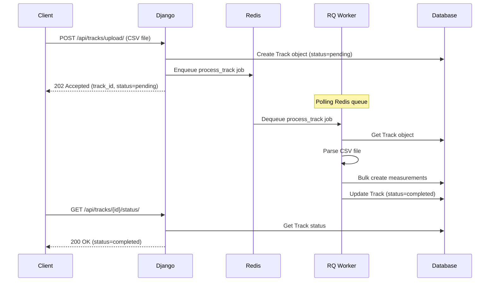

# Background Jobs with RQ

Understanding OpenRed's asynchronous task processing system.

## Overview

OpenRed uses **RQ (Redis Queue)** for background job processing with **two separate queues** for better performance and reliability.

### Queue Architecture

**1. `openred-tracks` (Critical Queue)**
- **Purpose:** Process uploaded track files (CSV, GPX, JSON)
- **Priority:** HIGH - User is waiting for results
- **Workers:** 2-3 workers recommended
- **Timeout:** 10 minutes per job

**2. `openred-weather` (Secondary Queue)**
- **Purpose:** Fetch weather data from Open-Meteo API
- **Priority:** LOW - Background enrichment
- **Workers:** 1 worker sufficient
- **Timeout:** 5-30 minutes per job

**Why separate queues?**
- ✅ Prioritization: Track uploads are user-facing, weather is background
- ✅ Independent scaling: More workers for tracks, fewer for weather
- ✅ Fault isolation: Weather API issues don't block track processing
- ✅ Resource optimization: Different timeout and retry policies



## Why RQ?

**RQ vs Celery:**

| Feature | RQ | Celery |
|---------|-----|--------|
| Complexity | Simple | Complex |
| Setup | Minimal | Extensive |
| Learning Curve | Easy | Steep |
| Features | Basic | Advanced |
| Use Case | Small to medium projects | Enterprise applications |

**Benefits of RQ:**
- ✅ Simple API (`enqueue(func, args)`)
- ✅ Built-in job monitoring
- ✅ Minimal configuration
- ✅ Perfect for CSV parsing and batch operations
- ✅ Native Python - no special syntax

**When to migrate to Celery:**
- Need advanced scheduling (cron-like tasks)
- Complex task chains and workflows
- High-volume job processing (>1000 jobs/minute)
- Multiple queue priorities

## Architecture Components

### 1. Redis - Message Broker

**Purpose:** Job queue storage

```bash
# Redis runs on port 6379
redis-server
```

**What Redis stores:**
- Pending jobs (serialized Python function calls)
- Job results (temporary storage)
- Worker status
- Failed job information

**Configuration:**
```python
# settings.py
RQ_QUEUES = {
    'default': {
        'HOST': 'localhost',
        'PORT': 6379,
        'DB': 0,
        'DEFAULT_TIMEOUT': 360,
    }
}
```

### 2. RQ Worker - Job Processor

**Purpose:** Execute background tasks

```bash
# Start RQ worker for tracks (critical)
python manage.py rqworker openred-tracks

# Start RQ worker for weather (secondary)
python manage.py rqworker openred-weather
```

**Worker process:**
1. Connect to Redis
2. Poll for jobs in queue
3. Deserialize job (function + args)
4. Execute function
5. Store result or exception
6. Mark job as complete/failed

**Multiple workers:**
```bash
# Terminal 1: Track processing
python manage.py rqworker openred-tracks

# Terminal 2: Track processing (additional)
python manage.py rqworker openred-tracks

# Terminal 3: Weather data
python manage.py rqworker openred-weather

# Jobs distributed automatically within each queue
```

### 3. Django Integration - Job Enqueueing

**Purpose:** Create jobs from Django views

```python
from django_rq import enqueue

# Enqueue a job
job = enqueue(process_track, track_id=123)
```

## Current Use Cases

### Track Processing

**Location:** `measures/tasks.py`

**Function:** `process_track(track_id)`

**What it does:**
1. Load Track object from database
2. Parse CSV/GPX file
3. Validate each row
4. Bulk create measurements (500 per batch)
5. Update track status

**Example:**
```python
# measures/tasks.py
def process_track(track_id):
    """
    Background task to process uploaded track files.
    
    Parses CSV/GPX files and creates measurements in batches.
    """
    try:
        track = Track.objects.get(id=track_id)
        track.status = 'processing'
        track.save()
        
        # Parse file based on extension
        if track.file.name.endswith('.csv'):
            measurements = parse_csv(track.file)
        elif track.file.name.endswith('.gpx'):
            measurements = parse_gpx(track.file)
        
        # Bulk create measurements (500 at a time)
        batch_size = 500
        for i in range(0, len(measurements), batch_size):
            batch = measurements[i:i+batch_size]
            RadiationMeasurement.objects.bulk_create(batch)
        
        track.status = 'completed'
        track.measurements_count = len(measurements)
        track.save()
        
    except Exception as e:
        track.status = 'failed'
        track.error_message = str(e)
        track.save()
        raise  # Re-raise for RQ to log
```

**Triggered by:**
```python
# measures/views.py
class TrackViewSet(viewsets.ModelViewSet):
    def create(self, request, *args, **kwargs):
        serializer = self.get_serializer(data=request.data)
        serializer.is_valid(raise_exception=True)
        track = serializer.save()
        
        # Enqueue background job
        enqueue(process_track, track.id)
        
        return Response(serializer.data, status=status.HTTP_202_ACCEPTED)
```

## Job Lifecycle

### Job States

```
┌─────────┐
│ QUEUED  │ Job added to Redis
└────┬────┘
     │
     ▼
┌─────────┐
│ STARTED │ Worker picks up job
└────┬────┘
     │
     ├────────┐
     │        ▼
     │   ┌─────────┐
     │   │ FAILED  │ Exception raised
     │   └─────────┘
     │
     ▼
┌─────────┐
│FINISHED │ Job completed successfully
└─────────┘
```

### Track-Specific Status

The `Track` model has its own status field:

```python
class Track(models.Model):
    STATUS_CHOICES = [
        ('pending', 'Pending'),
        ('processing', 'Processing'),
        ('completed', 'Completed'),
        ('failed', 'Failed'),
    ]
    status = models.CharField(max_length=20, choices=STATUS_CHOICES, default='pending')
```

**Status flow:**
1. **pending** - Track created, job enqueued
2. **processing** - Worker started execution
3. **completed** - All measurements created successfully
4. **failed** - Error during processing

## Monitoring Jobs

### Django RQ Dashboard

**Installation:**
```bash
pip install django-rq-dashboard
```

**Configuration:**
```python
# settings.py
INSTALLED_APPS += ['rq_dashboard']

# urls.py
urlpatterns += [
    path('admin/rq/', include('rq_dashboard.urls')),
]
```

**Access:** `http://localhost:8000/admin/rq/`

**Features:**
- View queued jobs
- Monitor workers
- Inspect failed jobs
- Retry failed jobs
- View job details and results

### Command Line Monitoring

**Check queue length:**
```bash
python manage.py rqstats
```

**Output:**
```
default      |████████████░░░░░░░░░░░░░░░| 123 queued
             |  1 workers, 2 jobs, 0 failed
```

**Inspect jobs:**
```python
from django_rq import get_queue

# Check tracks queue (critical)
tracks_queue = get_queue('openred-tracks')
print(f"Track jobs in queue: {len(tracks_queue)}")

# Check weather queue (secondary)
weather_queue = get_queue('openred-weather')
print(f"Weather jobs in queue: {len(weather_queue)}")

# Get job details
job = queue.fetch_job('job-id')
print(f"Status: {job.get_status()}")
print(f"Result: {job.result}")
```

## Error Handling

### Failed Jobs

RQ automatically:
- Catches exceptions
- Stores exception info
- Moves job to failed queue
- Logs error

**Access failed jobs:**
```python
from django_rq import get_failed_queue

failed_queue = get_failed_queue()
for job in failed_queue.jobs:
    print(f"Job {job.id} failed: {job.exc_info}")
```

**Retry failed job:**
```python
from django_rq import get_failed_queue
from rq.registry import FailedJobRegistry

# For tracks queue
queue = get_queue('openred-tracks')
registry = FailedJobRegistry(queue=queue)

# Requeue specific job
job_id = 'abc-123'
registry.requeue(job_id)
```

### Custom Error Handling

**In task function:**
```python
def process_track(track_id):
    try:
        # ... processing logic ...
        track.status = 'completed'
        track.save()
        
    except FileNotFoundError as e:
        track.status = 'failed'
        track.error_message = f"File not found: {e}"
        track.save()
        logger.error(f"Track {track_id} processing failed: {e}")
        
    except ValidationError as e:
        track.status = 'failed'
        track.error_message = f"Invalid data: {e}"
        track.save()
        logger.warning(f"Track {track_id} has invalid data: {e}")
        
    except Exception as e:
        track.status = 'failed'
        track.error_message = f"Unexpected error: {e}"
        track.save()
        logger.exception(f"Unexpected error processing track {track_id}")
        raise  # Re-raise for RQ to log
```

## Performance Optimization

### Batch Processing

**Problem:** Creating 10,000 measurements individually is slow

**Solution:** Bulk create in batches

```python
# BAD - 10,000 database transactions
for data in parsed_data:
    RadiationMeasurement.objects.create(**data)

# GOOD - 20 database transactions (500 per batch)
batch_size = 500
for i in range(0, len(parsed_data), batch_size):
    batch = parsed_data[i:i+batch_size]
    RadiationMeasurement.objects.bulk_create([
        RadiationMeasurement(**data) for data in batch
    ])
```

### Worker Scaling

**Single worker:**
- Processes jobs sequentially
- Good for development
- Simple to debug

**Multiple workers:**
```bash
# Start 3 workers for tracks (high priority)
for i in {1..3}; do
    python manage.py rqworker openred-tracks &
done

# Start 1 worker for weather (secondary)
python manage.py rqworker openred-weather &
```

- Processes jobs in parallel
- Faster for high-volume uploads
- Requires more memory/CPU

**Auto-scaling (production):**
- Use systemd/supervisor to manage workers
- Scale based on queue length
- AWS ECS/Kubernetes for cloud deployments

### Job Timeouts

**Default timeout:** 180 seconds (3 minutes)

**Custom timeout:**
```python
from django_rq import enqueue

# 10 minute timeout for large files
enqueue(process_track, track_id, timeout=600)
```

**In settings:**
```python
RQ_QUEUES = {
    'default': {
        'DEFAULT_TIMEOUT': 600,  # 10 minutes
    }
}
```

## Testing Background Jobs

### Synchronous Execution (Testing)

**Problem:** Don't want to run Redis/workers in tests

**Solution:** Execute jobs synchronously

```python
# settings_test.py
RQ_QUEUES = {
    'default': {
        'IS_ASYNC': False,  # Execute immediately
    }
}
```

**In tests:**
```python
from django.test import TestCase
from measures.tasks import process_track
from measures.models import Track

class TrackProcessingTests(TestCase):
    def test_process_track(self):
        # Create track
        track = Track.objects.create(file='test.csv', ...)
        
        # Job executes immediately (not in background)
        process_track(track.id)
        
        # Check results
        track.refresh_from_db()
        self.assertEqual(track.status, 'completed')
        self.assertEqual(track.measurements_count, 100)
```

### Mocking Jobs

**Skip job execution entirely:**
```python
from unittest.mock import patch

class TrackUploadTests(TestCase):
    @patch('measures.views.enqueue')
    def test_upload_enqueues_job(self, mock_enqueue):
        # Upload track
        response = self.client.post('/api/tracks/upload/', data={'file': file})
        
        # Verify job was enqueued
        mock_enqueue.assert_called_once()
        args, kwargs = mock_enqueue.call_args
        self.assertEqual(args[0], process_track)
```

## Production Setup

### Redis Configuration

**Production settings:**
```python
# settings_prod.py
RQ_QUEUES = {
    'default': {
        'HOST': os.environ.get('REDIS_HOST', 'redis'),
        'PORT': int(os.environ.get('REDIS_PORT', 6379)),
        'DB': 0,
        'PASSWORD': os.environ.get('REDIS_PASSWORD'),
        'DEFAULT_TIMEOUT': 600,
        'CONNECTION_POOL_KWARGS': {
            'max_connections': 50,
        }
    }
}
```

**Redis persistence:**
```bash
# redis.conf
save 900 1        # Save after 900 sec if 1 key changed
save 300 10       # Save after 300 sec if 10 keys changed
save 60 10000     # Save after 60 sec if 10000 keys changed
appendonly yes    # Enable append-only file
```

### Worker Management

**Systemd service:**
```ini
# /etc/systemd/system/openred-rqworker@.service
[Unit]
Description=OpenRed RQ Worker %i
After=network.target redis.service

[Service]
Type=simple
User=openred
WorkingDirectory=/opt/openred
ExecStart=/opt/openred/venv/bin/python manage.py rqworker openred-tracks
Restart=always
RestartSec=5

[Install]
WantedBy=multi-user.target
```

**Start multiple workers:**
```bash
systemctl start openred-rqworker@1
systemctl start openred-rqworker@2
systemctl enable openred-rqworker@{1..2}
```

### Monitoring & Alerting

**Worker health check:**
```python
from django_rq import get_queue
from django.core.management.base import BaseCommand

class Command(BaseCommand):
    def handle(self, *args, **options):
        tracks_queue = get_queue('openred-tracks')
        weather_queue = get_queue('openred-weather')
        
        tracks_workers = tracks_queue.workers
        weather_workers = weather_queue.workers
        
        if len(workers) == 0:
            # Alert: No workers running!
            send_alert("No RQ workers found")
        
        if len(queue) > 1000:
            # Alert: Queue backing up
            send_alert(f"Queue has {len(queue)} jobs pending")
```

**Prometheus metrics:**
```python
from prometheus_client import Gauge

queue_length = Gauge('openred_rq_queue_length', 'Number of jobs in RQ queue')
worker_count = Gauge('openred_rq_worker_count', 'Number of active RQ workers')

def update_metrics():
    tracks_queue = get_queue('openred-tracks')
    weather_queue = get_queue('openred-weather')
    
    queue_length.labels(queue='tracks').set(len(tracks_queue))
    queue_length.labels(queue='weather').set(len(weather_queue))
    
    worker_count.labels(queue='tracks').set(len(tracks_queue.workers))
    worker_count.labels(queue='weather').set(len(weather_queue.workers))
```

## Future Enhancements

Potential additions to the background job system:

### Scheduled Jobs

Use `rq-scheduler` for periodic tasks:
```python
from rq_scheduler import Scheduler

scheduler = Scheduler(connection=redis_conn)

# Run daily at midnight
scheduler.cron(
    "0 0 * * *",              # Cron expression
    func=cleanup_old_tracks,  # Function to run
)
```

### Job Priorities

Multiple queues for priority:
```python
# settings.py
RQ_QUEUES = {
    'high': {...},    # Critical jobs
    'default': {...}, # Normal jobs
    'low': {...},     # Batch processing
}

# Enqueue with priority
enqueue(urgent_task, queue_name='high')
```

### Job Dependencies

Chain jobs:
```python
from rq import Queue

queue = Queue()

# Job 2 runs after Job 1 completes
job1 = queue.enqueue(process_track, track_id)
job2 = queue.enqueue(generate_report, depends_on=job1)
```

## Troubleshooting

### Worker Not Processing Jobs

**Check worker is running:**
```bash
ps aux | grep rqworker
```

**Check Redis connection:**
```python
from django_rq import get_connection
conn = get_connection()
conn.ping()  # Should return True
```

**Check queue:**
```python
from django_rq import get_queue

# Check tracks queue
tracks_queue = get_queue('openred-tracks')
print(f"Track jobs: {len(tracks_queue)}")
print(f"Track workers: {len(tracks_queue.workers)}")

# Check weather queue
weather_queue = get_queue('openred-weather')
print(f"Weather jobs: {len(weather_queue)}")
print(f"Weather workers: {len(weather_queue.workers)}")
```

### Jobs Timing Out

**Increase timeout:**
```python
enqueue(long_running_task, timeout=1800)  # 30 minutes
```

**Split into smaller jobs:**
```python
# Instead of processing 10,000 measurements in one job
enqueue(process_track_batch, track_id, start=0, end=1000)
enqueue(process_track_batch, track_id, start=1000, end=2000)
# ... etc
```

### Memory Issues

**Symptoms:** Worker crashes, out of memory errors

**Solutions:**
- Process files in smaller batches
- Use `iterator()` for large QuerySets
- Increase worker memory limits
- Scale horizontally (more workers, not bigger)

## Further Reading

- **[RQ Documentation](https://python-rq.org/)** - Official RQ docs
- **[Django RQ](https://github.com/rq/django-rq)** - Django integration
- **[Redis Documentation](https://redis.io/docs/)** - Redis guide
- **[System Architecture](overview.md)** - Overall system design
- **[Uploading Tracks Guide](../guides/uploading-tracks.md)** - User-facing guide

