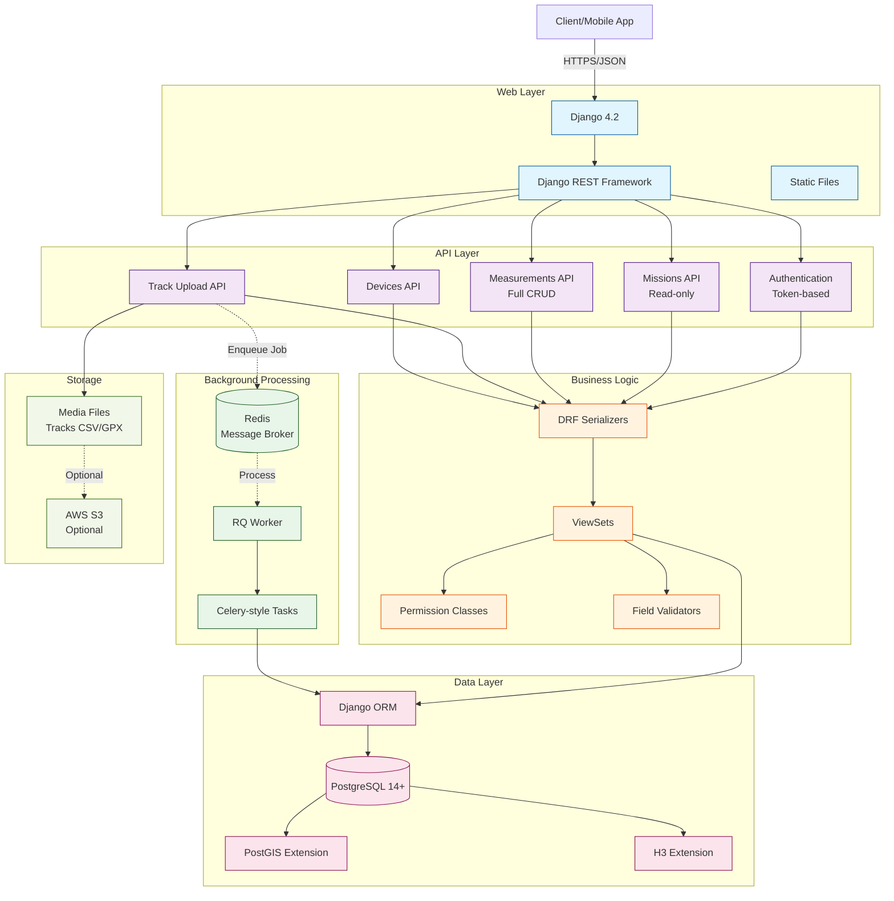

# System Architecture

High-level overview of OpenRed's technical architecture.

## Architecture Diagram



## Technology Stack

### Core Framework

**Django 4.2** - Web framework
- Handles HTTP requests/responses
- ORM for database access
- Built-in admin interface
- URL routing and middleware

**Django REST Framework (DRF)** - API framework
- RESTful API conventions
- Serialization/deserialization
- ViewSets for CRUD operations
- Token authentication
- Permission system
- Pagination, filtering, search

### Database

**PostgreSQL 14+** - Relational database
- ACID compliance
- Complex queries with joins
- JSON field support
- Full-text search

**PostGIS** - Geospatial extension
- Spatial data types (Point, LineString, Polygon)
- Geographic distance calculations
- Spatial indexing (GiST)
- Coordinate transformations

**H3** - Hexagonal indexing system
- Uber's geospatial indexing
- Aggregation by hex grid
- Multi-resolution support

### Background Processing

**Redis** - In-memory data store
- Message broker for task queue
- Fast key-value storage
- Job status tracking

**RQ (Redis Queue)** - Task queue
- Asynchronous job processing
- Simpler alternative to Celery
- CSV/GPX file parsing
- Measurement batch creation

### Storage

**Local File System** - Default storage
- Development/testing
- Track CSV/GPX uploads

**AWS S3** - Optional cloud storage
- Production deployments
- CDN integration
- Scalable file storage

### Authentication

**Django Allauth** - User management
- Registration/login
- Email verification
- Password reset

**DRF Token Authentication** - API auth
- Simple token-based auth
- `Authorization: Token <key>` header
- Per-user tokens

## Application Structure

OpenRed is organized into Django apps, each with a specific responsibility:

### Core Apps

#### `missions/`
**Purpose:** Project organizational structure

- **Models:** `Project`, `Mission`, `Campaign`
- **API:** Read-only organizational endpoints
- **Permissions:** Owner-based access control
- **Admin:** Create/edit organizational entities

#### `measures/`
**Purpose:** Measurement data and track processing

- **Models:** `RadiationMeasurement`, `LightPollutionMeasurement`, `Track`
- **API:** Full CRUD for measurements, track upload
- **Tasks:** Asynchronous CSV/GPX parsing
- **Permissions:** Complex role-based permissions

#### `devices/`
**Purpose:** Device registration and management

- **Models:** `Device`
- **API:** Device CRUD operations
- **Validation:** Unique identifiers, owner assignment

#### `users/`
**Purpose:** User accounts and profiles

- **Models:** `CustomUser` (extends Django User)
- **API:** User registration, profile
- **Adapters:** Allauth custom behavior

#### `frontend/`
**Purpose:** Web UI (optional)

- **Views:** Template-based pages
- **Static Files:** CSS/JS for UI
- **Templates:** HTML pages

### App Communication

```
missions.Project ← measures.RadiationMeasurement.project (FK)
missions.Campaign ← measures.Track.campaign (FK)
devices.Device ← measures.RadiationMeasurement.device (FK)
users.User ← missions.Project.created_by (FK)
```

## Request Flow

### Typical API Request

1. **Client Request**
   ```
   POST /api/radiation-measurements/
   Authorization: Token abc123...
   Content-Type: application/json
   ```

2. **Django Middleware**
   - CORS headers (if enabled)
   - Session management
   - Authentication check

3. **URL Routing**
   ```python
   # urls.py
   path('api/', include(router.urls))
   ```

4. **ViewSet Method**
   ```python
   # measures/views.py
   class RadiationMeasurementViewSet(viewsets.ModelViewSet):
       def create(self, request):
           # Handle POST request
   ```

5. **Permission Check**
   ```python
   permission_classes = [IsAuthenticated, CanCreateMeasurement]
   ```

6. **Serializer Validation**
   ```python
   serializer = RadiationMeasurementSerializer(data=request.data)
   serializer.is_valid(raise_exception=True)
   ```

7. **Database Operation**
   ```python
   instance = serializer.save(created_by=request.user)
   ```

8. **Response**
   ```json
   {
     "id": 123,
     "project": 1,
     "device": 5,
     "cpm": 100,
     ...
   }
   ```

### Track Upload Flow

More complex flow involving background processing:

1. **Client Uploads CSV**
   ```
   POST /api/tracks/upload/
   Authorization: Token abc123...
   Content-Type: multipart/form-data
   ```

2. **ViewSet Saves File**
   ```python
   track = Track.objects.create(
       file=request.FILES['file'],
       project=project,
       device=device
   )
   ```

3. **Enqueue Background Job**
   ```python
   from django_rq import enqueue
   enqueue(process_track, track.id)
   ```

4. **Immediate Response**
   ```json
   {
     "id": 456,
     "status": "pending",
     "file": "/media/tracks/2024/11/data.csv"
   }
   ```

5. **RQ Worker Processes (Async)**
   ```python
   # tasks.py
   def process_track(track_id):
       track = Track.objects.get(id=track_id)
       # Parse CSV
       # Create measurements
       # Update status
   ```

6. **Client Polls Status**
   ```
   GET /api/tracks/456/status/
   ```

   ```json
   {
     "status": "completed",
     "measurements_created": 1523
   }
   ```

## Data Flow

### Write Operations

```
Client Request
    ↓
API Endpoint
    ↓
Permission Check
    ↓
Serializer Validation
    ↓
Model Validation (clean methods)
    ↓
Django ORM
    ↓
PostgreSQL Transaction
    ↓
PostGIS/H3 Processing (if geo data)
    ↓
Response to Client
```

### Read Operations

```
Client Request
    ↓
API Endpoint
    ↓
Permission Check (can view?)
    ↓
QuerySet Filtering (by project, device, etc.)
    ↓
Pagination (default 100 items)
    ↓
Serializer (model → JSON)
    ↓
Response to Client
```

## Security Architecture

### Authentication Layers

1. **User Authentication** - Django Allauth
   - Username/email + password
   - Email verification
   - Password reset

2. **API Token** - DRF Token Auth
   - One token per user
   - Stateless authentication
   - Token in `Authorization` header

### Permission System

**Object-Level Permissions** - Custom DRF permissions

```python
class IsProjectOwner(permissions.BasePermission):
    def has_object_permission(self, request, view, obj):
        return obj.created_by == request.user
```

**Hierarchical Permissions** - Cascade from project

```
Project Owner
    ↓
Can view/edit Project
    ↓
Can view Missions in Project
    ↓
Can view/create Measurements in Project
```

**Public vs Private** - Project-level visibility

```python
if project.is_public:
    # Anyone can view (read-only)
else:
    # Only authorized users
```

### Data Validation

1. **Serializer-level** - Field types, required fields
2. **Model-level** - `clean()` methods, constraints
3. **Database-level** - Unique constraints, foreign keys

## Deployment Architecture

### Development Setup

```
┌─────────────────────┐
│   Django DevServer   │ :8000
│   (runserver)        │
└──────────┬───────────┘
           │
┌──────────┴───────────┐
│   PostgreSQL          │ :5432
│   (local instance)    │
└──────────┬───────────┘
           │
┌──────────┴───────────┐
│   Redis               │ :6379
│   (local instance)    │
└──────────┬───────────┘
           │
┌──────────┴───────────┐
│   RQ Worker           │
│   (python manage.py   │
│    rqworker)          │
└──────────────────────┘
```

### Production Setup

```
┌─────────────────────┐
│   Load Balancer      │
│   (Nginx/AWS ELB)    │
└──────────┬───────────┘
           │
    ┌──────┴──────┐
    │             │
┌───▼────┐   ┌───▼────┐
│Gunicorn│   │Gunicorn│ (multiple workers)
│Django  │   │Django  │
└───┬────┘   └───┬────┘
    │             │
    └──────┬──────┘
           │
┌──────────┴───────────┐
│   PostgreSQL RDS      │ (managed)
│   + PostGIS + H3      │
└──────────┬───────────┘
           │
┌──────────┴───────────┐
│   Redis ElastiCache   │ (managed)
└──────────┬───────────┘
           │
┌──────────┴───────────┐
│   RQ Workers (ECS)    │ (auto-scaling)
└──────────────────────┘
           │
┌──────────┴───────────┐
│   AWS S3              │ (file storage)
└──────────────────────┘
```

## Performance Considerations

### Database Optimization

**Indexes:**
- Spatial indexes on geographic fields (GiST)
- B-tree indexes on foreign keys
- Composite indexes on frequent query combinations

**Query Optimization:**
- `select_related()` for foreign keys
- `prefetch_related()` for many-to-many
- `.only()` / `.defer()` for large models

**Connection Pooling:**
- PostgreSQL connection pooling
- Django `CONN_MAX_AGE` setting

### Caching Strategy

**Database Query Cache:**
- Redis cache backend
- Cache frequently accessed projects/missions

**API Response Cache:**
- Cache read-only endpoints
- Cache-Control headers

### Background Processing

**Why RQ instead of Celery?**
- Simpler setup
- Sufficient for our use case
- Better for smaller teams

**Job Priorities:**
- High: User-facing track uploads
- Low: Periodic data aggregation

## Monitoring & Logging

### Logging Levels

```python
DEBUG - Development only
INFO - Important events (user registration, track upload)
WARNING - Recoverable errors (validation failures)
ERROR - Exceptions, failed jobs
CRITICAL - System failures
```

### Health Checks

```
GET /api/health/
{
  "status": "ok",
  "database": "connected",
  "redis": "connected",
  "rq_workers": 2
}
```

## Further Reading

- **[Data Hierarchy](data-hierarchy.md)** - Understanding the organizational structure
- **[Apps Structure](apps-structure.md)** - Detailed app responsibilities
- **[Background Jobs](background-jobs.md)** - RQ worker system
- **[API Reference](../api-reference/missions.md)** - Complete API documentation
