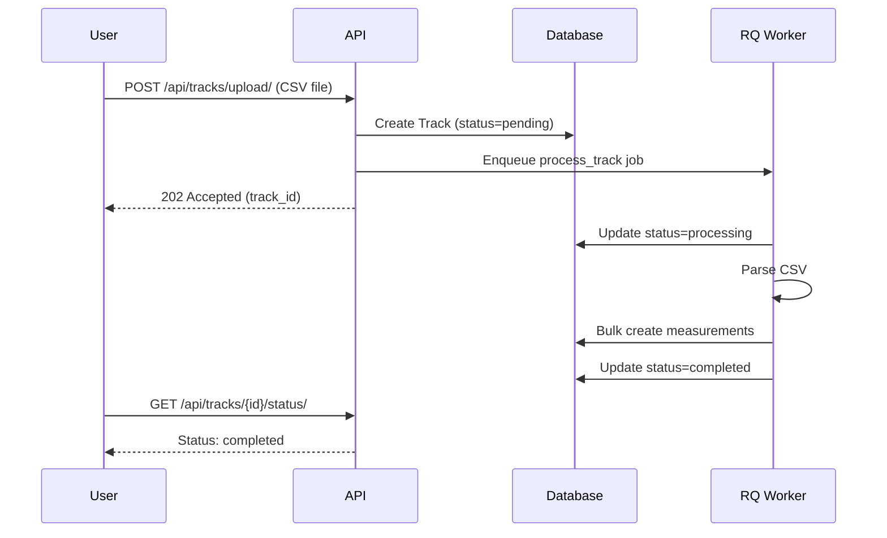

# Uploading Track Files

Complete guide to batch uploading measurements via CSV/GPX files.

## Overview

The Track Upload feature allows batch import of measurements from files. The system processes files **asynchronously using RQ (Redis Queue)** to handle large files with thousands of measurements without blocking HTTP requests.

### Key Features

- ✅ **Asynchronous processing** - Non-blocking file upload
- ✅ **CSV support** - Standard format (GPX planned)
- ✅ **Automatic timezone handling** - Converts naive datetimes
- ✅ **Bulk creation** - Efficient batch inserts (1000 per batch)
- ✅ **Status tracking** - Monitor processing state
- ✅ **Campaign association** - Optional organizational linking
- ✅ **Automatic naming** - Track name from filename
- ✅ **Measurement linking** - All measurements reference track

---

## What is a Track?

A **Track** represents an uploaded file (CSV/GPX) containing multiple measurement data points.

**Upload workflow:**



**When you upload a track:**

1. Track record created in database with `status='pending'`
2. File saved to disk (`media/tracks/YYYY/MM/DD/`)
3. RQ background job processes the file
4. Each CSV row becomes a **RadiationMeasurement** with `track` FK
5. Track status changes to `'completed'` or `'failed'`

---

## Track vs Direct Measurements

| Creation Method | Track FK | Use Case |
|----------------|----------|----------|
| **CSV Upload** | ✅ Set | Batch import from file |
| **API POST** | ❌ None | Single measurement creation |

```python
# Measurements from track
measurement.track = Track(id=5, name="data.csv")  # Imported from CSV

# Direct measurement (no track)
measurement.track = None  # Created via API POST
```

---

## Data Hierarchy

Tracks can exist at different organizational levels:

```
Project (required)
  └─ Mission (optional)
       └─ Campaign (optional)
            └─ Track
                 └─ Measurements (track FK set)
```

**Track with campaign (organized):**
```python
track.project     # Required - Project ID
track.campaign    # Optional - Campaign ID
track.mission     # Property - Derived from campaign.mission
track.name        # Property - Filename (read-only)
```

**Track without campaign (loose data):**
```python
track.project     # Required - Project ID
track.campaign    # None
track.mission     # None
track.name        # Property - Filename (read-only)
```

See [Data Hierarchy](../architecture/data-hierarchy.md) for complete details.

---

## API Endpoints

### Upload Track File

**Endpoint:** `POST /api/tracks/upload/`

**Authentication:** Required (Token)

**Content-Type:** `multipart/form-data`

**Parameters:**

| Parameter | Type | Required | Description |
|-----------|------|----------|-------------|
| `file` | File | Yes | CSV or GPX file with measurements |
| `device` | Integer | Yes | Device ID that captured the data |
| `project` | Integer | Yes | Project ID (radiation/light_pollution) |
| `campaign` | Integer | No | Optional campaign ID |

**cURL Example:**
```bash
curl -X POST https://api.openred.org/api/tracks/upload/ \
  -H "Authorization: Token YOUR_TOKEN" \
  -F "file=@measurements.csv" \
  -F "device=5" \
  -F "project=1" \
  -F "campaign=3"
```

**Python Example:**
```python
import requests

headers = {"Authorization": "Token YOUR_TOKEN"}
files = {"file": open("measurements.csv", "rb")}
data = {
    "device": 5,
    "project": 1,
    "campaign": 3,  # optional
}

response = requests.post(
    "https://api.openred.org/api/tracks/upload/",
    headers=headers,
    files=files,
    data=data
)

print(response.json())
```

**JavaScript Example:**
```javascript
const formData = new FormData();
formData.append("file", fileInput.files[0]);
formData.append("device", "5");
formData.append("project", "1");
formData.append("campaign", "3");

fetch("https://api.openred.org/api/tracks/upload/", {
    method: "POST",
    headers: {
        "Authorization": "Token YOUR_TOKEN"
    },
    body: formData
})
.then(response => response.json())
.then(data => console.log(data));
```

**Response (202 ACCEPTED):**
```json
{
    "id": 42,
    "name": "measurements.csv",
    "file": "/media/tracks/2024/11/measurements.csv",
    "project": 1,
    "device": 5,
    "campaign": 3,
    "status": "pending",
    "total_measurements": 0,
    "created_at": "2024-11-20T15:00:00Z"
}
```

**Notes:**
- Returns **202 ACCEPTED** (not 201) since processing is async
- Track starts with `status='pending'`
- Background worker processes the file
- Use `/api/tracks/{id}/status/` to check progress

---

### Check Track Status

**Endpoint:** `GET /api/tracks/{id}/status/`

**Authentication:** Required (Token)

**Example:**
```bash
curl -H "Authorization: Token YOUR_TOKEN" \
     https://api.openred.org/api/tracks/42/status/
```

**Response (Pending):**
```json
{
    "id": 42,
    "status": "pending",
    "total_measurements": 0,
    "error_message": null
}
```

**Response (Processing):**
```json
{
    "id": 42,
    "status": "processing",
    "total_measurements": 523,
    "error_message": null
}
```

**Response (Completed):**
```json
{
    "id": 42,
    "status": "completed",
    "total_measurements": 1000,
    "start_time": "2024-11-03T10:00:00Z",
    "end_time": "2024-11-03T10:16:40Z",
    "error_message": null,
    "processing_time": "2.3 seconds"
}
```

**Response (Failed):**
```json
{
    "id": 42,
    "status": "failed",
    "total_measurements": 0,
    "error_message": "Invalid CSV format: missing 'latitude' column"
}
```

**Status values:**
- `pending` - Waiting for processing
- `processing` - Currently being parsed
- `completed` - Successfully processed
- `failed` - Processing failed (see `error_message`)

---

### Retrieve Track Details

**Endpoint:** `GET /api/tracks/{id}/`

**Example:**
```bash
curl -H "Authorization: Token YOUR_TOKEN" \
     https://api.openred.org/api/tracks/42/
```

**Response:**
```json
{
    "id": 42,
    "name": "measurements.csv",
    "file": "/media/tracks/2024/11/measurements.csv",
    "file_type": "csv",
    "project": 1,
    "device": 5,
    "campaign": 3,
    "mission": 1,
    "description": "",
    "status": "completed",
    "total_measurements": 1000,
    "start_time": "2024-11-03T10:00:00Z",
    "end_time": "2024-11-03T10:16:40Z",
    "created_at": "2024-11-20T15:00:00Z",
    "created_by": 3,
    "updated_at": "2024-11-20T15:00:03Z",
    "error_message": null
}
```

---

### Get Measurements from Track

**Endpoint:** `GET /api/radiation-measurements/?track={id}`

**Example:**
```bash
curl -H "Authorization: Token YOUR_TOKEN" \
     "https://api.openred.org/api/radiation-measurements/?track=42"
```

**Response:**
```json
{
    "count": 1000,
    "next": "https://api.openred.org/api/radiation-measurements/?track=42&page=2",
    "previous": null,
    "results": [
        {
            "id": 12345,
            "project": 1,
            "device": 5,
            "campaign": 3,
            "track": 42,
            "latitude": 40.4168,
            "longitude": -3.7038,
            "cpm": 25,
            "usv_h": 0.125,
            "dateTime": "2024-11-03T10:00:00Z"
        },
        // ... 99 more
    ]
}
```

---

## CSV Format

### Required Structure

```csv
timestamp,latitude,longitude,cpm,radiation_value
2024-11-03T10:00:00Z,40.4168,-3.7038,100,0.50
2024-11-03T10:01:00Z,40.4169,-3.7039,105,0.52
2024-11-03T10:02:00Z,40.4170,-3.7040,110,0.55
```

### Required Columns

| Column | Type | Description | Example |
|--------|------|-------------|---------|
| `timestamp`* | String | ISO 8601 datetime | `2024-11-03T10:00:00Z` |
| `latitude` | Float | Decimal degrees (-90 to 90) | `40.4168` |
| `longitude` | Float | Decimal degrees (-180 to 180) | `-3.7038` |
| `radiation_value` | Float | Radiation measurement value | `0.50` |

*Accepted column names: `timestamp`, `dateTime`, `datetime`

### Optional Columns

| Column | Type | Description | Example |
|--------|------|-------------|---------|
| `cpm` | Integer | Counts per minute | `100` |
| `altitude` | Float | Meters above sea level | `667.0` |
| `accuracy` | Float | GPS accuracy in meters | `15.0` |

### Timestamp Formats

**Recommended (with timezone):**
```csv
# UTC
2024-11-03T10:00:00Z

# With offset
2024-11-03T11:00:00+01:00    # CET
2024-11-03T05:00:00-05:00    # EST
```

**Acceptable (uses default timezone):**
```csv
# Will be interpreted as TIME_ZONE setting
2024-11-03T10:00:00
2024-11-03 10:00:00
```

See [DateTime Fields Guide](datetime-fields.md) for complete timezone documentation.

---

## Track Model Fields

### Database Fields

| Field | Type | Description |
|-------|------|-------------|
| `id` | Integer | Primary key |
| `name` | String (Property) | **Read-only** - Filename (`"data.csv"`) |
| `project` | ForeignKey | Associated project (required) |
| `device` | ForeignKey | Device used for measurements (required) |
| `campaign` | ForeignKey | Campaign (optional) |
| `file` | FileField | Uploaded file path |
| `file_type` | String | File type (`csv`, `gpx`, `json`) |
| `description` | Text | Track description (optional) |
| `start_time` | DateTime | First measurement timestamp (auto) |
| `end_time` | DateTime | Last measurement timestamp (auto) |
| `total_measurements` | Integer | Number of measurements created |
| `status` | String | Processing status |
| `error_message` | Text | Error details if failed |
| `created_at` | DateTime | Upload timestamp (auto) |
| `created_by` | ForeignKey | User who uploaded |
| `updated_at` | DateTime | Last update timestamp (auto) |

### Properties (Read-Only)

- **`name`**: Automatically set from filename (e.g., `"example_track.csv"`)
- **`mission`**: Derived from `campaign.mission` (None if no campaign)

**Important:** The `name` field is **not writable** - always derived from uploaded filename.

---

## Permissions

### Track Operations

| Action | Anonymous | Authenticated (Owner) | Authenticated (Other) |
|--------|-----------|----------------------|----------------------|
| **GET list** | ✅ Public projects only | ✅ Public + own tracks | ✅ Public projects only |
| **GET retrieve** | ✅ If project public | ✅ If public or own | ✅ If project public |
| **POST upload** | ❌ 401 Unauthorized | ✅ Can upload | ✅ Can upload |
| **PUT/PATCH** | ❌ 401 | ✅ Own tracks only | ❌ 404 Not Found |
| **DELETE** | ❌ 401 | ✅ Own tracks only | ❌ 404 |

### Measurements from Tracks

All measurements created from a track:
- Are automatically linked via `track` FK
- Belong to the user who uploaded the track
- Follow the same permissions as regular measurements
- Can be viewed publicly (if project is public)
- Can only be modified/deleted by owner

---

## Error Handling

### Common Errors

| HTTP Code | Reason | Solution |
|-----------|--------|----------|
| 400 | No file provided | Include `file` in request |
| 400 | No device ID | Include `device` parameter |
| 400 | No project ID | Include `project` parameter |
| 400 | Invalid CSV format | Check CSV structure and headers |
| 400 | No valid measurements | Verify CSV has data rows |
| 401 | Not authenticated | Include valid token in Authorization header |
| 404 | Device/Project not found | Verify IDs exist |
| 413 | File too large | Split into smaller files |

### Track Status Errors

If `status='failed'`, check `error_message` field:

```python
track = requests.get(f"/api/tracks/{id}/").json()

if track['status'] == 'failed':
    print(f"Error: {track['error_message']}")
    # Example errors:
    # "Invalid CSV format: missing 'latitude' column"
    # "No valid measurements found in CSV file"
    # "Invalid timestamp format in row 523"
```

---

## Complete Workflow Example

### Step 1: Prepare CSV File

```csv
timestamp,latitude,longitude,cpm,radiation_value,altitude
2024-11-03T10:00:00Z,40.4168,-3.7038,100,0.50,667
2024-11-03T10:01:00Z,40.4169,-3.7039,105,0.52,668
2024-11-03T10:02:00Z,40.4170,-3.7040,110,0.55,670
```

### Step 2: Get Authentication Token

```bash
curl -X POST https://api.openred.org/api/auth/login/ \
  -H "Content-Type: application/json" \
  -d '{"username": "user", "password": "pass"}'
```

Response:
```json
{
    "token": "abc123xyz456..."
}
```

### Step 3: Upload Track

```bash
TOKEN="abc123xyz456..."

curl -X POST https://api.openred.org/api/tracks/upload/ \
  -H "Authorization: Token $TOKEN" \
  -F "file=@data.csv" \
  -F "device=5" \
  -F "project=1"
```

Response:
```json
{
    "id": 42,
    "status": "pending",
    "name": "data.csv"
}
```

### Step 4: Poll Status

```bash
# Check every 2 seconds until completed
while true; do
    curl -H "Authorization: Token $TOKEN" \
         https://api.openred.org/api/tracks/42/status/
    sleep 2
done
```

### Step 5: View Measurements

```bash
curl -H "Authorization: Token $TOKEN" \
     "https://api.openred.org/api/radiation-measurements/?track=42"
```

---

## Performance Notes

- **Bulk insert**: 1000 measurements per batch for efficiency
- **Processing time**: ~1-3 seconds per 1000 measurements
- **Large files**: Files with 10,000+ rows are handled without issue
- **Background processing**: Upload returns immediately, processing happens async

---

## File Storage

Uploaded files are stored in:
```
media/tracks/YYYY/MM/DD/filename.csv
```

Example:
```
media/tracks/2024/11/20/measurements_abc123.csv
```

For production deployments, configure S3 storage (see [Deployment Guide](../deployment/production-setup.md)).

---

## Related Documentation

- **[DateTime Fields](datetime-fields.md)** - Understanding timestamp fields
- **[Measurements API](../api-reference/measures.md)** - API endpoints
- **[Background Jobs](../architecture/background-jobs.md)** - How async processing works
- **[Data Hierarchy](../architecture/data-hierarchy.md)** - Track relationships
