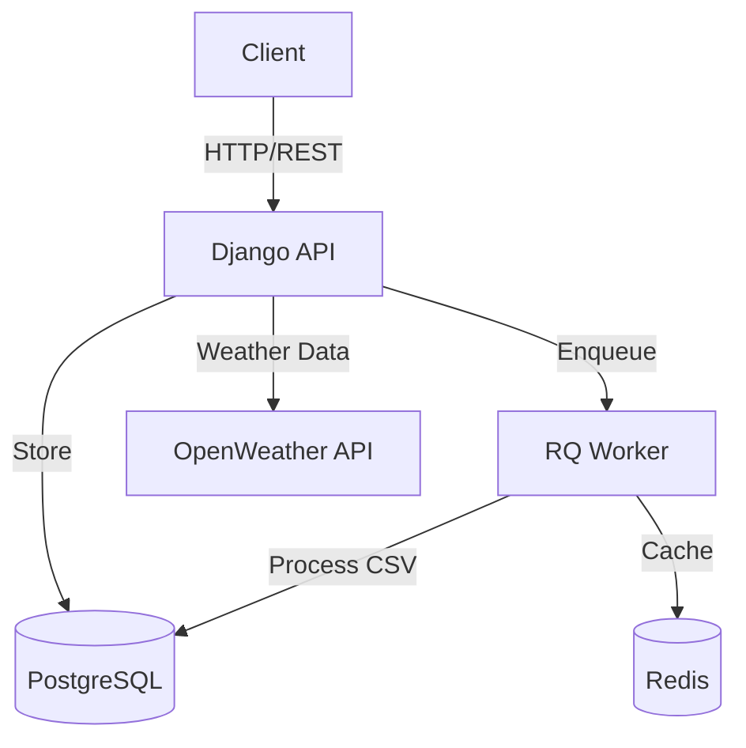

# OpenRed Documentation

Welcome to **OpenRed**, an open platform for collecting, storing, and visualizing radiation and environmental measurement data.

## What is OpenRed?

OpenRed is a Django-based REST API that enables:

- 📊 **Data Collection**: Upload measurements from radiation detectors and environmental sensors
- 🗂️ **Organization**: Structure data using Projects, Missions, and Campaigns
- 📁 **Batch Import**: Upload CSV/GPX files with thousands of measurements
- 🌐 **Public Access**: Share data publicly or keep it private
- 🔍 **Filtering**: Query data by location, time, device, and more

## Key Features

### Asynchronous Processing
Track uploads are processed in the background using **RQ (Redis Queue)**, allowing you to upload large files without blocking.

### Flexible Hierarchy
Organize your data at multiple levels:

```
Project (radiation/light_pollution)
  └─ Mission (optional)
       └─ Campaign (optional)
            ├─ Track (CSV/GPX upload)
            └─ Individual Measurements
```

### Public or Private
Control data visibility at the project level - make your measurements public for citizen science or keep them private.

## Quick Links

- **[Installation Guide](getting-started/installation.md)** - Set up OpenRed in minutes
- **[Quick Start](getting-started/quick-start.md)** - Your first measurement upload
- **[Data Hierarchy](architecture/data-hierarchy.md)** - Understanding the data structure
- **[API Reference](api-reference/missions.md)** - Complete API documentation
- **[Uploading Tracks](guides/uploading-tracks.md)** - Batch import CSV files

## Technology Stack

- **Backend**: Django 4.2 + Django REST Framework
- **Database**: PostgreSQL with PostGIS
- **Task Queue**: RQ (Redis Queue)
- **Authentication**: Token-based (dj-rest-auth)
- **API Docs**: Swagger/OpenAPI (drf-yasg)

## Architecture Overview



## Use Cases

OpenRed is perfect for:

- 🎓 **Research Projects** - Academic radiation/light pollution studies
- 🌍 **Citizen Science** - Community-driven environmental monitoring
- 🏢 **Organizations** - Environmental data management platforms
- 📱 **Mobile Apps** - Backend for measurement collection applications

## Getting Help

- 📖 Read the [User Guides](guides/uploading-tracks.md)
- 🐛 [Report issues on GitHub](https://github.com/Ibercivis/OpenRed/issues)
- 💬 Join our community discussions

---

**Ready to start?** → [Installation Guide](getting-started/installation.md)
